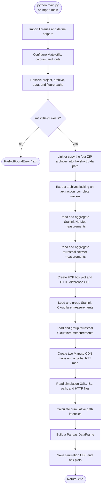

# Learning guide: `main.py`

## What this program does

`main.py` is an exported Jupyter notebook rather than a conventional command-line application. It analyses Starlink and terrestrial CDN measurements, compares their latency, and writes seven PDF figures. It also analyses a satellite-network simulation and produces two additional latency plots.

Run it from the repository directory with:

```powershell
python .\main.py
```

The script expects the downloaded `m1756495` dataset and reads two optional environment variables:

- `DATA_PATH`: where extracted data should live. Its default is `..\d`, a deliberately short Windows path.
- `OUTPUT_PATH`: where the output directory is created. Its default is `..\Figs`. Note that the plotting calls themselves currently save to `..\Figs`.

## Entry points

There is **no `main()` function** and no `if __name__ == "__main__":` guard. Consequently, there are two practical entry points:

1. **Command-line entry:** `python main.py` starts at line 1 and runs every top-level statement in file order.
2. **Import entry:** `import main` also runs every top-level statement. This is usually surprising; importing the module triggers archive extraction, data processing, figure creation, and `plt.show()` calls.

The module begins by importing libraries and defining its first two helper functions. After that, execution immediately starts configuring plots, locating data, extracting archives, processing measurements, and generating figures.

## High-level execution flow



The redirection to **X** is the only deliberate early stop. Other missing keys, malformed JSON, unavailable libraries, or plotting errors can also stop the script because most exceptions are not caught.

## Setup and data loading

### City-name cleanup — `city_lookup_key(value)` (lines 31–42)

Some records use incorrectly decoded text such as `Göttingen`. This function makes names comparable:

1. It returns a non-string value unchanged.
2. It tries to reinterpret Latin-1 bytes as UTF-8.
3. It decomposes accented characters with Unicode NFKD normalization.
4. It keeps only letters and digits, then lowercases the result.

For example, visually different spellings can become a comparable lookup key. It returns a normalized string.

### City lookup — `find_city(city_name, normalized_cities)` (lines 45–50)

**Inputs:** a raw city name and a dictionary whose keys are normalized city names and whose values are city metadata.  
**Returns:** the metadata dictionary for the city, or `None` when no sufficiently similar city exists.  
**How it works:** it calls `city_lookup_key`, tries a constant-time exact dictionary lookup, then uses `difflib.get_close_matches` with a `0.86` cutoff as a fallback. The fuzzy fallback is useful for damaged source encoding but can theoretically select a similarly named city; callers handle a `None` result by skipping the record.

### Archive/data setup (lines 57–119)

The program:

1. Finds the project directory from `__file__` and switches the working directory there.
2. Treats `m1756495` as the source archive directory.
3. Uses `..\d` as the default extracted-data directory, keeping paths below the Windows length limit.
4. Creates hard links to the four ZIP files when possible; otherwise it copies them.
5. Extracts each ZIP only when its `.extraction_complete` marker is absent.

The four archives are NetMet measurements, helper files, Cloudflare measurements, and simulation results.

## NetMet aggregation and first figures

### Starlink aggregation (lines 126–207)

The first loop reads files whose names contain AS14593, Starlink's ASN. It ignores speed-test records and retains web-browsing records only when:

- a client city can be resolved to a country;
- HTTP status is `200`;
- the CDN cache result contains `hit`.

The resulting nested dictionary is:

```text
country -> URL -> metric -> list of observed values
```

Metrics include HTTP response time, DNS lookup time, TCP connection time, page load time, and first contentful paint (FCP).

### Terrestrial aggregation (lines 214–300)

This repeats the same process for non-Starlink files. It ignores speed tests, Starlink records, and clients marked as using a VPN in `all_netmet_user_ip_details.json`.

### FCP box plot and HTTP-response CDF (lines 312–437)

The first plot compares Starlink and terrestrial FCP for Germany and Great Britain. The second plot compares the per-URL median HTTP response-time difference for all countries found in both datasets. A positive difference means Starlink took longer.

## Cloudflare analysis and geographic plots

Lines 445–867 load two Cloudflare datasets: global Starlink client results and terrestrial client-facing results. They build dictionaries that group RTT samples by country, city, and CDN airport/location.

The code then:

- builds a Maputo client-to-CDN map for Starlink;
- builds the equivalent terrestrial map;
- selects the best CDN per user city, requiring at least 100 RTT samples;
- aggregates best-CDN RTTs by country;
- produces a global map of median Starlink RTT minus median terrestrial RTT.

Negative values on the global map mean Starlink was faster; positive values mean terrestrial access was faster.

### `plot_gsdata(gsdata_df, ax, label, marker, color, size=10, lw=0.6)` (lines 874–882)

**Inputs:** a DataFrame with `lat` and `long` columns; a Matplotlib axis; legend label; marker; colour; and optional marker size/line width.  
**Returns:** `None`.  
**Side effect:** calls `ax.scatter`, adding the points directly to the existing Cartopy/Matplotlib map. The legend label is attached to that plotted point collection. It assumes the two coordinate columns exist and will raise `KeyError` if they do not.

## Simulation-analysis functions

The final section turns satellite path/simulation JSON files into latency distributions.

### `find_files(directory, prefix)` (lines 962–963)

**Inputs:** a directory path and a filename prefix.  
**Returns:** a list of matching *filenames*, not full paths.  
**Important detail:** callers must combine each result with `directory` before opening it. `os.listdir` raises `FileNotFoundError` when the directory does not exist.

### `parse_timestamp(filename)` (lines 966–969)

**Input:** a filename ending in `_<YYYYMMDD>_<HHMMSS>.<extension>`.  
**Returns:** a `datetime` object.  
**Failure mode:** a differently named file raises `ValueError` (or an indexing error), because the code assumes the final two underscore-separated parts are a valid timestamp.

### `read_json_file(filepath)` (lines 972–974)

**Input:** a path to a JSON file.  
**Returns:** the Python list or dictionary produced by `json.load`.  
**Failure mode:** missing files raise `FileNotFoundError`; invalid JSON raises `json.JSONDecodeError`.

### `process_gsl_files(directory)` (lines 977–987)

**Input:** the simulation-results directory.  
**Returns:** one flat list of all numeric `latency` values found in files beginning `gsl_latency_bw_`.  
**Side effect:** writes the same values, comma-separated, to a file named `cdf0` in the simulation data directory. “GSL” is the ground-station link portion of a satellite path. The function expects every JSON item to contain a `latency` key.

### `process_path_files(directory)` (defined twice)

There are two functions with this name:

- The first definition at lines 990–1018 prints diagnostics and writes `other_cdfs`.
- The second definition at lines 1079–1097 replaces the first one before it can be called.

Therefore, the active version only reads each `path_` file, finds the closest timestamped GSL and ISL files, calls `calculate_latencies`, and returns one latency vector per path. It does **not** write `other_cdfs` or print the diagnostics from the earlier definition. This is an accidental override and a good candidate for deletion during refactoring.

### `find_matching_file(directory, prefix, timestamp)` (lines 1021–1023)

**Inputs:** a directory, a prefix such as `gsl_latency_bw_`, and a target `datetime`.  
**Returns:** the filename with the smallest absolute time difference from the target.  
**Failure mode:** if no filename begins with the prefix, `min(...)` raises `ValueError`.

### `process_http_responses(filename)` (lines 1026–1041)

**Input:** the accumulated Starlink HTTP-response JSON path.  
**Returns:** one flat list of HTTP response times strictly greater than 25 ms and strictly less than 80 ms.  
**How it works:** it traverses four nested dictionary levels—outer group, city, CDN provider, and CDN location—then extends the output list with the accepted measurements. Values outside the range are intentionally excluded as outliers/non-comparable samples.

### `calculate_latencies(path_info, gsl_data, isl_data)` (lines 1044–1076)

**Inputs:** `path_info` (filename followed by satellite IDs), GSL edge data, and ISL edge data.  
**Returns:** a list of ten cumulative latencies, representing the path after one through ten satellite hops.  
**This is the core simulation calculation.**

1. The first list item is a path filename; the rest are satellite identifiers in the route.
2. It reads source and destination station identifiers from the filename.
3. It finds the ground-to-first-satellite latency.
4. It adds an inter-satellite-link (ISL) latency for each subsequent hop, up to ten hops.
5. Missing hops are filled with the last calculated non-zero latency.
6. It returns ten cumulative latency values, one for each hop count.

### `read_terrestrial(filename)` (lines 1100–1102)

**Input:** a path to a JSON array of terrestrial latencies.  
**Returns:** a new list containing only values below 80 ms.  
**Purpose:** applies the same upper-bound filtering idea used for the simulated/Starlink comparison.

### `create_dataframe(cdf0, other_cdfs, cdf7, cdf8)` (lines 1105–1126)

**Inputs:** raw GSL data (`cdf0`), calculated path vectors (`other_cdfs`), filtered Starlink HTTP responses (`cdf7`), and terrestrial values (`cdf8`).  
**Returns:** a Pandas DataFrame with one series per cache/hop scenario and two observed-network series.  
**How it works:** it chooses a maximum column length, pulls selected positions from each ten-value path vector, and pads shorter arrays with `NaN`. Pandas uses `NaN` to represent absent values, allowing columns to have equal length. `cdf0` is accepted but not used in the current implementation—another useful cleanup opportunity.

### `plot_cdf(df)` (lines 1129–1160)

**Input:** the DataFrame from `create_dataframe`.  
**Returns:** `None`.  
**Side effects:** removes `NaN` from each column, sorts values, calculates an empirical CDF (`1/n` through `1`), draws all series on one axis, displays the figure, and saves `cdn_cdf_plot.pdf`. Starlink and terrestrial lines use different black dashed/dotted styles; satellite scenarios use colours from `tab10`.

### `adjust_box(plot, idx)` (lines 1163–1166)

**Inputs:** a Matplotlib box-plot result dictionary and a colour index.  
**Returns:** `None`.  
**Side effect:** changes the first box's face colour and its median line. This definition replaces the earlier `adjust_box(plot)` function from lines 315–318. Neither version is called by the current program, so they have no runtime effect.

### `plot_boxplot(df)` (lines 1169–1213)

**Input:** the DataFrame from `create_dataframe`.  
**Returns:** `None`.  
**Side effects:** selects only the `3 ISLs`, `5 ISLs`, and `10 ISLs` columns; draws a horizontal box plot; changes colours, whiskers, caps, and medians; draws a 17 ms terrestrial reference line; displays the plot; and saves `satellite_cdn_percentile.pdf`.

## Final top-level calls

Lines 1219–1234 assemble the simulation inputs and call:

```python
cdf0 = process_gsl_files(directory)
other_cdfs = process_path_files(directory)
cdf7 = process_http_responses(http_response_file)
cdf8 = read_terrestrial(terrestrial)
df = create_dataframe(cdf0, other_cdfs, cdf7, cdf8)
plot_cdf(df)
plot_boxplot(df)
```

This is the closest thing the script has to its final analysis entry point.

## Exit points

The program has no explicit `sys.exit()` or `exit()` call. It ends naturally after `plot_boxplot(df)` returns. It may exit early through an uncaught exception, including:

- `FileNotFoundError` if `m1756495` is absent (line 80) or expected data files are missing.
- `KeyError` when an input record lacks an assumed dictionary key.
- `json.JSONDecodeError` for malformed JSON.
- `zipfile.BadZipFile` for corrupt archives.
- Matplotlib, GeoPandas, Cartopy, or filesystem exceptions while generating figures.

Inside `process_path_files`'s first (overwritten) definition, an exception while writing `other_cdfs` is caught, printed, and causes that function to return `None`; this behavior is irrelevant because the second definition replaces it.

## Files written

The script writes these PDFs to `..\Figs`:

- `fcp_abs_boxplot_horizontal.pdf`
- `starlink_vs_terrestrial_country_wise_http_delta.pdf`
- `starlink_maputo_cdn_latency.pdf`
- `terrestrial_Maputo_cdn_latency.pdf`
- `terrestrial_vs_starlink_rtt_difference_global_heatmap_bestCDN.pdf`
- `cdn_cdf_plot.pdf`
- `satellite_cdn_percentile.pdf`

It can also write intermediate simulation files named `cdf0` and `other_cdfs` under the extracted simulation directory, although the active `process_path_files` definition no longer writes `other_cdfs`.

## Suggested next refactor

To make this easier to learn from and reuse, first move each top-level analysis block into a named function, then add:

```python
def main():
    # setup, load data, build plots
    pass


if __name__ == "__main__":
    main()
```

That change would make importing the helpers safe, provide one clear program entry point, and allow unit tests for the calculation functions.
